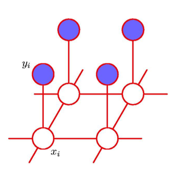

# ImageDenoising

🗓 Spring 2019 

## Project  Description
Recovering a clean image from noisy input image through representing the image using the pairwise Markov random field model and implementing coordinate descent.

Resulted in ~99.4% accuracy.

## Technical Details

The noisy image $y_i \in \left\{ -1, +1 \right\}$  indexed by the pixels $i = 1, ... , D$  in the lattice is obtained by randomly flipping the signs of the pixels of the noise free image $x_i \in \{-1, +1\}$ with some probability.

The graphical model used is a pairwise Markov Random Field (MRF) shown below.

There are two types of cliques in this MRF. For  $\{x_i, y_i\}$, we define the energy function $-\eta x_i y_i (\eta > 0).$ Lower energy is achieved when $x_i$ and $y_i$ have the same sign and a higher energy when they have the opposite sign. For  neighboring pixels $\{x_i, x_j\}$, we want the energy to be lower when the same sign than when they have opposite sign. So the energy function is $-\beta x_i x_j (\beta > 0).$ Lastly, we have an energy term $hx_i$ for each pixel i to bias the model towards one particular sign (either + or −). 

Giving the final energy function for the model:

$$
E(\mathbf{x},\mathbf{y}) = h \sum_i x_i -\beta \sum_{\{i,j\}} x_i x_j - \eta \sum_{i} x_iy_i
$$

which defines a joint distribution over x and y given by

$$
p(\mathbf{x},\mathbf{y}) = \frac{1}{Z} exp\{-E(\mathbf{x},\mathbf{y})\}
$$

coordinate-descent algorithm:
1. Initialize $\{x_i\} (x_i=y_i), h>0, \beta >0, \eta>0$.
2. For each $x_i$ , fix the neighborhood and see whether $- x_i$ would decrease the energy, if so flip $-x_i$.
3. Stop when no changes can be made for $\mathbf{x}$.
4. Optimize parameters $h, \beta > \eta$ until desired recovery accuracy.
